# Analogplotter

**A sensitometry tool for black-and-white film testing — made to help you understand your process.**

Analogplotter turns densitometer readings into characteristic curves and reads everything a darkroom worker needs from them: contrast, film speed, development aims, and a full scene-to-print tone reproduction analysis. It runs entirely in the browser as a single HTML file — no install, no server, no account.

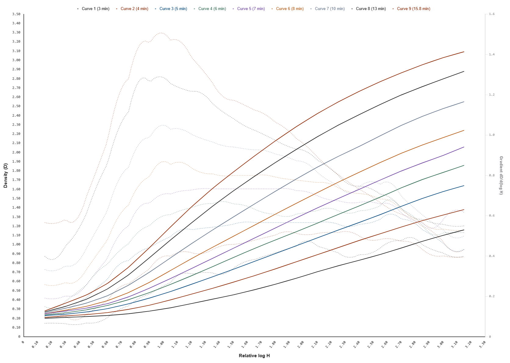

## Introduction

This is a tool made to help you understand your process. Enter your exposure as the X axis and your measured densities as the Y axis. Compare and analyze the tested Films behavior. Analogplotter allows you to enter your paper curves too. Based on this it will simulate the tonal compression and quality of transfer to the end medium (your paper). This tool requires you to already have a good understanding of the underlying processes. It will not help you all that much to learn the basics, but will reward you more and more in your journey of learning, when you begin to see the value in certain features. It might seem confusing at first but becomes simple over time.

## How to Use

1. **Enter your X coordinates** under the **Exposure** tab. Select your exposure type: 
   * **Relative Exposure:** Use this if you don't know the illuminance at the film plane in lux-seconds.
   * **Absolute Exposure:** Use this if you have a calibrated exposure setup and know the exact lux-seconds at the film plane.

   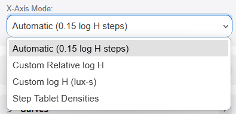

2. **Choose how film speed shall be determined.** Under the **EFS** (Effective Film Speed) tab, select your preferred method. I recommend **Delta X**. *(If you aren't sure which to pick, just use Delta X and continue).*

   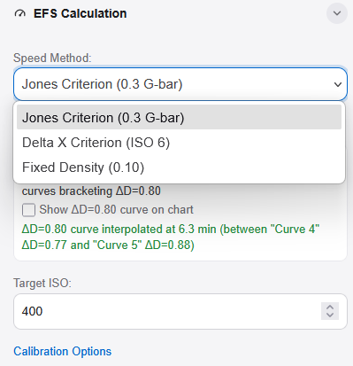

3. **Enter your details**, such as your name, the film type, and any other relevant metadata.

   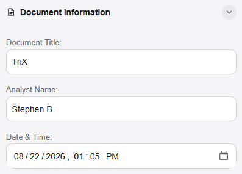

4. **Add your first curve** under the **Curves** tab. Type your density measurements directly into the text field (format: `0.00, 0.00, ...`). 
   * *Note:* If you use the [Dektronics Densitometer](https://github.com/dektronics/printalyzer-uvdensitometer), the software will automatically accept its USB output format. Enter your measurements as cleanly and accurately as possible—while the program automatically denoises the data, cleaner input yields better results.

   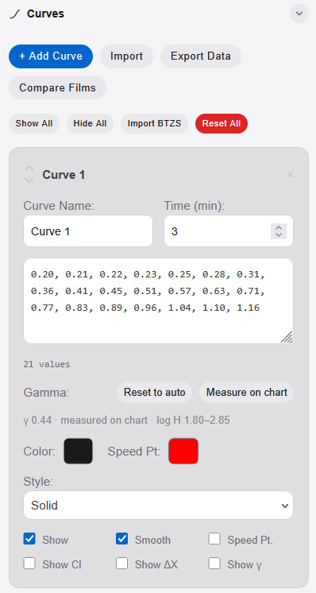

5. **Review your curves.** After entering all of your test wedges (about 8 per session is recommended), you will see the curves generated in the main plot area. You can hover your mouse over the curves to read out the data. Display settings can be adjusted under the **Chart Grid Control** tab.

   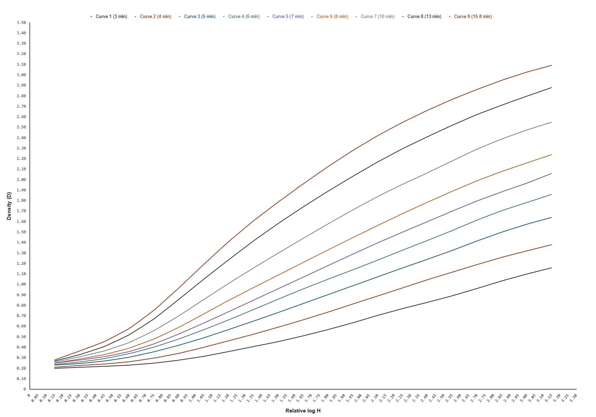

6. **Set your Flare model and Paper LER** (Log Exposure Range).
   * **Flare:** Flare is introduced in every optical system and lifts the shadows based on the scene's contrast ratio (even with modern lenses). The tool is designed to account for this. **Dynamic Flare** automatically adjusts shadow lifting based on scene contrast, making it a great set-and-forget option. **Fixed Flare** allows you to enter a custom flare value that will be applied across all scenes. 
   * **Paper LER:** This is the goal density range you want to achieve. It depends on your enlarger and the contrast grade where your paper performs best. Most users aim for an LER of 1.1 (typical for a diffuse enlarger).

   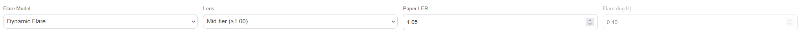

7. **Export your findings.** Once everything is set, you can export your data as a PDF or as a `.json` file. The JSON format allows you to share dynamic save files with friends, who can import them into their own instance of Analogplotter to interact with the data.

   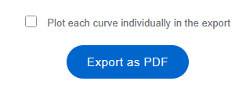

8. **Analyze your results.** The tool will output data below your curves, telling you exactly how you need to expose and develop a given scene to achieve your defined density range.

   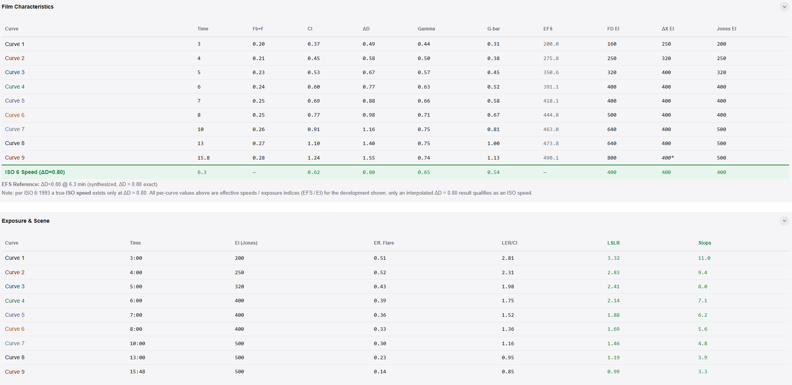

9. **Dive deeper with paper data.** If you want to go further, you can start entering your paper data using the same logic as the film curve plotting. This tool can help you find optimal settings for your CMY filter heads. *Tip: Place your test strip into the negative carrier so optical effects are factored into the curve sets.*

   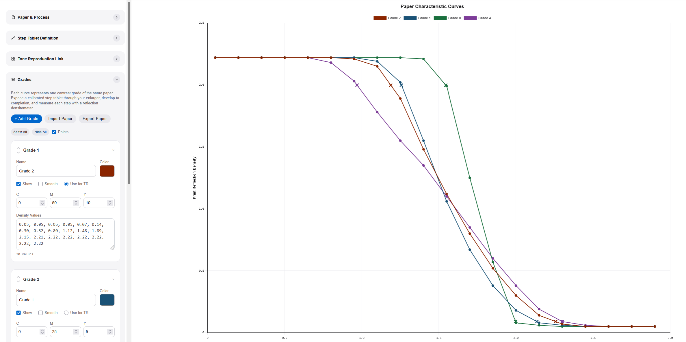

10. **Simulate the tonal transfer.** With data for both film and paper entered, navigate to the **Tone Reproduction** tab to simulate the entire tonal transfer. You can experiment with exposure, flare, and different curves to see how they behave in reality, deepening your understanding of the analog process.

    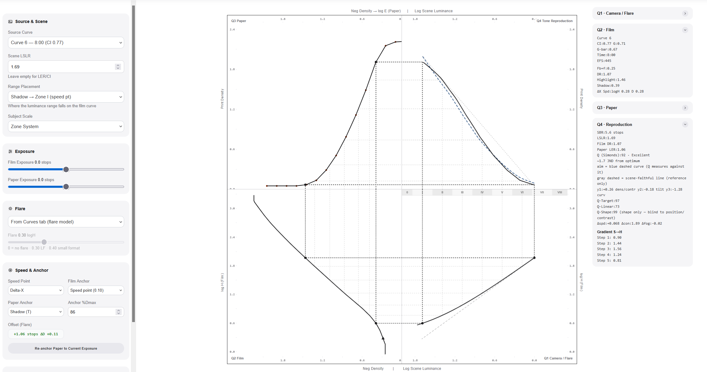
    
Made by René Böhmer · [analogworkshops.at](https://www.analogplotter.com) · free to use

*Changelog: see [UPDATE.md](UPDATE.md)*
