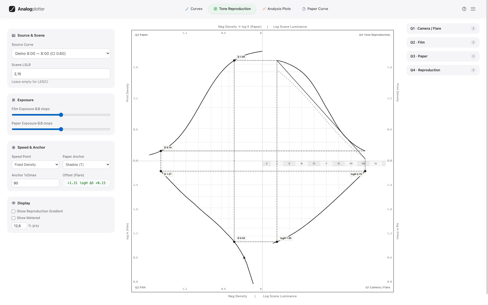
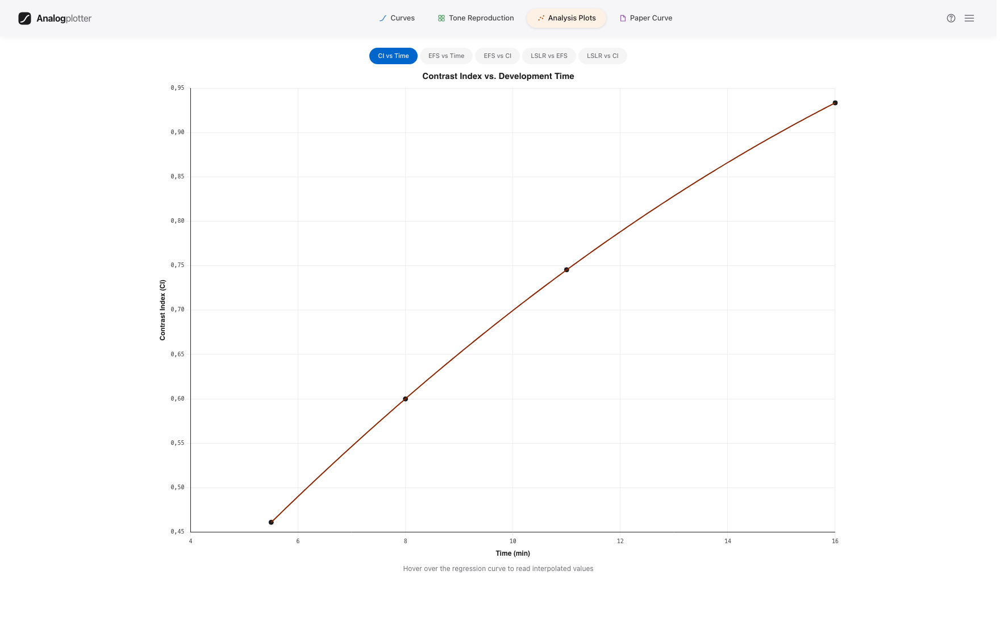
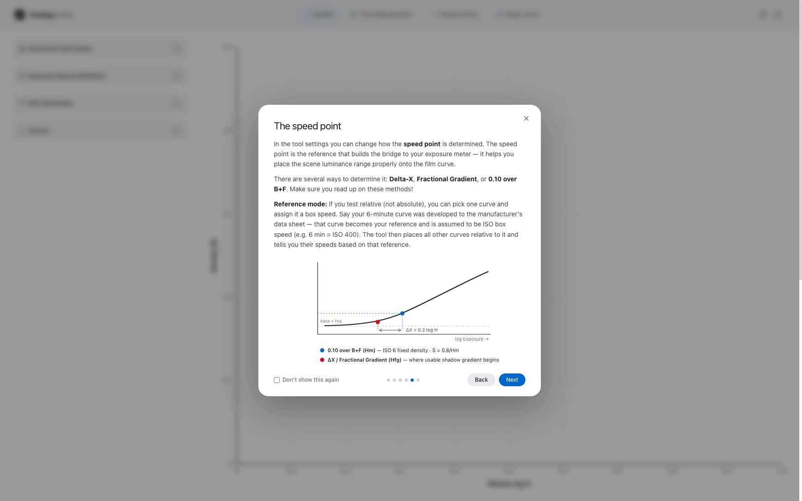

# Analogplotter

**A sensitometry tool for black-and-white film testing — made to help you understand your process.**

Analogplotter turns densitometer readings into characteristic curves and reads everything a darkroom worker needs from them: contrast, film speed, development aims, and a full scene-to-print tone reproduction analysis. It runs entirely in the browser as a single HTML file — no install, no server, no account.

## Features

### Film curves
- **H&D characteristic curves** from step-wedge readings — automatic 0.15 steps, custom log H, step-tablet densities (relative testing), or absolute lux·seconds (absolute testing with real ISO determination)
- **Contrast metrics**: Contrast Index (Kodak concentric-arc method), gamma, Ḡ
- **Film speed three ways**: fixed density 0.10 over B+F (ISO 6), Delta-X criterion (Nelson & Simonds), fractional gradient (Jones 0.3Ḡ) — plus a synthetic interpolated ΔD = 0.80 curve per ISO 6:1993 Annex A
- **Development aims**: required CI, dev time and EI for N−2 … N+3 expansions/contractions, with fixed or dynamic flare models
- Crosshair hover readout, live value counters, tolerant paste (any separator), undo for deletions, and automatic session recovery — your data survives a reload

### Tone reproduction
The classical Jones four-quadrant diagram, computed from **your measured film and paper curves**: camera flare → film → paper → cumulative scene-to-print reproduction, with per-stop gradient analysis and quality metrics.

### Paper curves
Measure your darkroom papers grade by grade: LER, ISO(R)-style ranges, grade interpolation to a target LER, and CMY filtration bookkeeping — and feed the measured paper directly into the tone reproduction diagram.

### Analysis plots
CI vs time, EFS vs time, EFS vs CI, LSLR relationships — the practical plots for choosing a development time.

### Reports
One-click PDF reports: curve plots at 3× resolution, film characteristics, exposure & scene tables, development aims, tone reproduction pages, analysis plots, raw data, and a calculation-transparency section with references. JSON session export/import and BTZS `.pfc` import included.

### Built-in guide
A short illustrated introduction explains absolute vs. relative testing, how to run a development series, and how the three speed criteria differ — with a one-click realistic example dataset.

## Verified against the primary literature

The core formulas were checked line by line against the original sources:

- ISO 6:1993 — speed point, ΔD = 0.80 contrast condition, S = 0.8/Hm, third-stop rounding
- Nelson & Simonds (1956) — Delta-X regression (coefficient-exact) and the 1.5 log H fractional-gradient interval
- Niederpruem, Nelson & Yule (1966) — Contrast Index arc geometry
- Jones & Condit (1941), Todd & Zakia (1964), Simonds (1963), Connelly (1968) — flare, scene statistics, speed method history
- "What is Normal" developmental model — flare 0.40, LER 1.05, normal LSLR 2.20, CI 0.58

Per ISO 6:1993 a true ISO speed exists only at ΔD = 0.80; the tool deliberately labels all other per-development values as effective speeds (EFS/EI).

## Getting started

Open `index.html` in a desktop browser — that's it. First visit shows the guided introduction; the **?** button in the header reopens it anytime. Load the example dataset to explore before entering your own measurements.

**Requirements**: a modern desktop browser and an internet connection (Chart.js, Tailwind, jsPDF and html2canvas load from CDNs).

## The workflow in one paragraph

Expose several film strips identically through a step wedge, develop each for a different time, measure every step with a densitometer, and paste the readings in. You get a family of curves — a function of exposure vs. density — from which the tool derives contrast, speed, and the development time that matches your scene range, enlarger, and paper.

---

Made by René Böhmer · [analogworkshops.at](https://www.analogworkshops.at) · free to use

*Changelog: see [UPDATE.md](UPDATE.md)*
